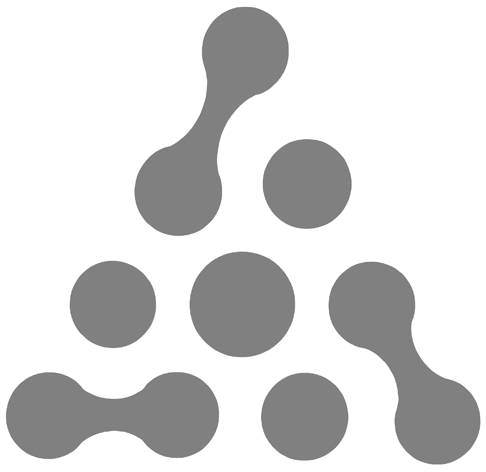
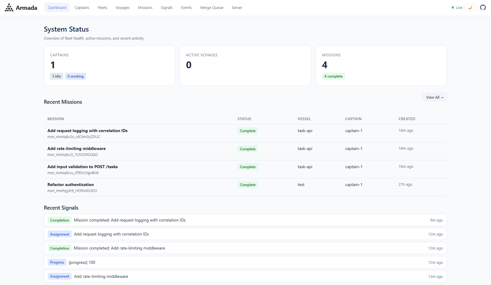
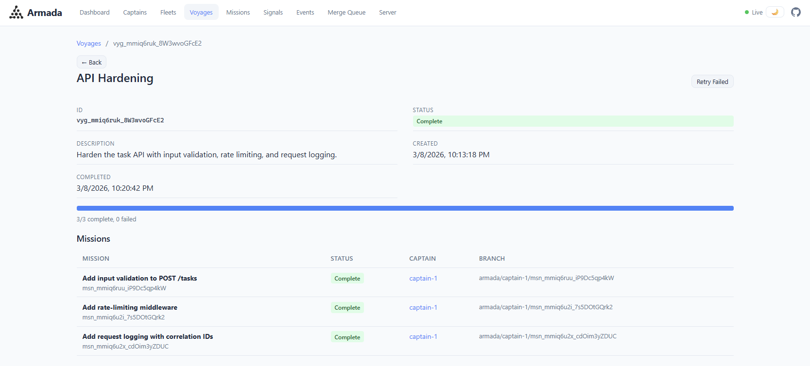
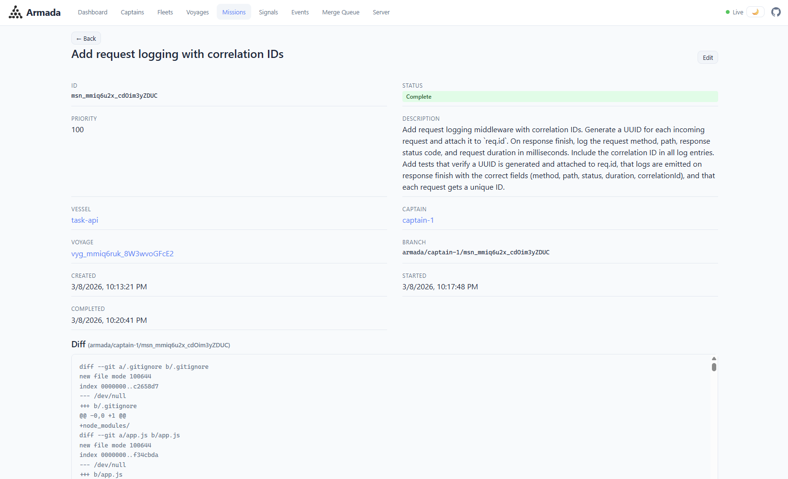
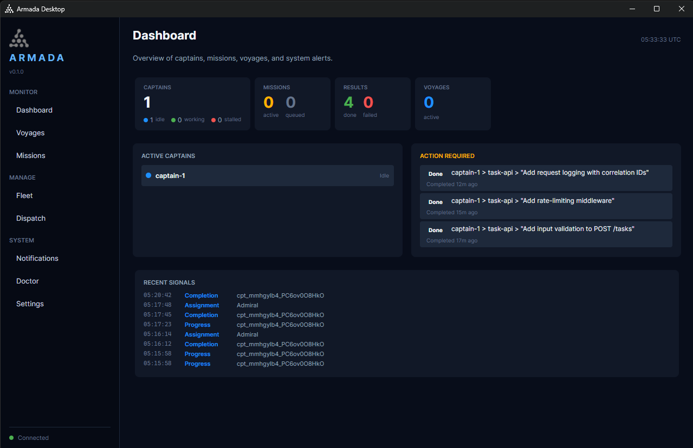

<p align="center">
  
</p>

<h1 align="center">Armada</h1>

<p align="center">
  <strong>Reduce context switching across projects. Keep agent work in queryable memory.</strong>
  <br />
  <em>v0.7.0 alpha -- APIs and schemas may change</em>
</p>

<p align="center">
  <a href="#why-armada">Why Armada</a> |
  <a href="#how-it-works">How It Works</a> |
  <a href="#quick-start">Quick Start</a> |
  <a href="#pipelines">Pipelines</a> |
  <a href="#use-cases">Use Cases</a> |
  <a href="#architecture">Architecture</a> |
  <a href="#rest-api">API</a> |
  <a href="#mcp-integration">MCP</a>
</p>

---

## Why Armada

Armada is for people working across multiple repositories who are tired of paying the context-switching tax every time they come back to a project.

The first problem is operational: switching between projects means rebuilding context over and over. What was in flight, what already landed, what failed, what the agent was about to do next. That overhead adds up fast.

The second problem is memory. Most agent sessions disappear into terminal history and branch diffs. A week later, neither you nor the next agent has a clean way to ask "what happened here?" without manually piecing it back together.

Armada is built around those two problems:

1. **Reduce context switching across projects.** Armada keeps the state of work outside your head. You can dispatch, leave, come back later, and see where things stand without reconstructing everything from scratch.

2. **Provide extended, queryable memory for both users and agents.** Missions, logs, diffs, status changes, and related work are preserved behind a searchable interface. You no longer have to remember what you were working on; you can ask. Agents can do the same.

Armada gives models a place to maintain working context on a vessel over time. Agents can update vessel context with notes, hints, and project-specific guidance so the next dispatch does not have to rediscover the same facts from scratch. That reduces context load time for both humans and models.

Everything else in Armada exists to support that: isolated worktrees, parallel dispatch, pipelines, retries, dashboards, API access, and MCP tools.

### What You Get

- **Less project-switch overhead.** Leave one repo, work somewhere else, then come back to a current view of what happened.
- **A queryable memory layer.** Logs, diffs, status history, and agent output stay available through the dashboard, API, and MCP instead of vanishing into scrollback.
- **Integrated API tooling.** `System > Requests` preserves request history, while `System > API Explorer` lets you execute live OpenAPI-backed requests and replay captured traffic without leaving the dashboard.
- **A first-class repository workspace.** `Workspace` gives you a vessel-aware file tree, in-browser editing, search, git-aware status, and direct handoff into planning, dispatch, and context curation.
- **Project-specific delivery profiles.** `Delivery > Workflow Profiles` lets each vessel or fleet declare how it lints, builds, tests, packages, versions, deploys, rolls back, and verifies itself.
- **Structured check execution.** `Delivery > Checks` turns build, test, deploy, and verification runs into queryable records with logs, artifacts, retry, branch/commit metadata, and links back to missions and voyages.
- **Scoped objectives and delivery memory.** `Operations > Objectives` captures acceptance criteria, non-goals, linked vessels, and evidence so work can be scoped before dispatch without falling back to external notes.
- **First-class delivery records and timeline history.** `Delivery > Environments`, `Deployments`, and `Releases` group rollout targets, approvals, verification evidence, linked voyages, missions, checks, versions, notes, and artifacts, while `Activity > History` lets you reconstruct the current cross-entity delivery story from one place.
- **Operational incident and runbook support.** `Activity > Incidents` and `System > Runbooks` carry rollback context, hotfix handoff, step-by-step execution, and deployment-linked operational guidance inside Armada itself.
- **Persistent vessel context.** Models can maintain repository-specific context, hints, and working notes on each vessel to speed up future dispatches.
- **Interactive planning before dispatch.** Chat with a captain in the dashboard, keep the transcript, then open the result in Dispatch or launch the work directly from the planning screen.
- **Parallel execution across repos.** Dispatch work to multiple agents across multiple repositories at once.
- **Quality gates that run automatically.** Every piece of work can flow through a pipeline: plan it, implement it, test it, review it. No manual intervention between steps.
- **Git isolation by default.** Every agent works in its own worktree on its own branch. Agents can't step on each other. Your main branch stays clean until you merge.
- **Configurable and extensible workflows.** Prompt templates, personas, and pipelines are user-controlled, so you can adapt the system to your project instead of fitting your project to the built-ins.
- **Reusable playbooks at dispatch time.** Store markdown guidance such as `CSHARP_BACKEND_ARCHITECTURE.md`, manage it in the dashboard, and select it per voyage or mission with inline or file-based delivery modes.
- **Works with the agents you already have.** Claude Code, Codex, Gemini, Cursor, and Mux -- pluggable runtime system.
- **Guided setup in the dashboard.** First-run configuration can stay inside the setup wizard instead of bouncing between unrelated pages.
- **Internationalized dashboard UX.** Login, shared shell UI, list/detail/admin routes, setup flows, notifications, pagination, server management, and legacy embedded dashboard surfaces support live language selection and locale-aware formatting.

### Who It's For

- **Solo developers** working across multiple repos.
- **Tech leads** who want a record of what agents changed.
- **Teams** that need shared visibility into agent-driven work.
- **Anyone** who wants more structure than a single-agent terminal loop.

---

## How It Works

<table align="center">
<tr><td>
<pre>
+-----------------------------------------------------------+     +-----------------------------------------------------------+
| Direct Dispatch                                           |     | Planning In The Dashboard                                 |
| CLI / API / MCP sends work immediately                    |     | Chat with a captain inside the UI on a reserved dock      |
+-----------------------------------------------------------+     +-----------------------------------------------------------+
                              |                                               |
                              |                                               v
                              |                          +-----------------------------------------------------------+
                              |                          | Select a planning reply                                    |
                              |                          | Summarize it, open it in Dispatch, or dispatch directly   |
                              |                          +-----------------------------------------------------------+
                              |                                               |
                              +-------------------------------+---------------+
                                                              |
                                                              v
                         +-----------------------------------------------------------+
                         | Admiral                                                   |
                         | Coordinates work, resolves pipeline, assigns captains,    |
                         | provisions worktrees, and tracks mission state            |
                         +-----------------------------------------------------------+
                                                              |
                                                              v
                         +-----------------------------------------------------------+
                         | Architect                                                 |
                         | Reads the codebase, breaks work into missions, and        |
                         | identifies file boundaries                                |
                         +-----------------------------------------------------------+
                                                              |
                                                              v
                         +-----------------------------------------------------------+
                         | Worker                                                    |
                         | Implements the mission in an isolated git worktree        |
                         | and produces a diff                                       |
                         +-----------------------------------------------------------+
                                                              |
                                                              v
                         +-----------------------------------------------------------+
                         | TestEngineer                                              |
                         | Reviews the worker diff and adds or updates tests         |
                         +-----------------------------------------------------------+
                                                              |
                                                              v
                         +-----------------------------------------------------------+
                         | Judge                                                     |
                         | Reviews correctness, completeness, scope, and style       |
                         | Produces PASS or FAIL                                     |
                         +-----------------------------------------------------------+
</pre>
</td></tr>
</table>

1. **You choose the entry point.** Dispatch directly from the CLI/API/MCP, or start a planning session in the dashboard and chat with a captain first.
2. **Planning can hand off directly to execution.** From the planning UI, select an assistant reply and either summarize it into a dispatch draft, open it in the main Dispatch page, or dispatch it directly without copy/paste.
3. **The Admiral coordinates execution.** It resolves the pipeline, assigns captains, provisions worktrees, and tracks mission state.
4. **The Architect plans.** It reads the codebase, breaks the work into missions, and identifies likely file boundaries.
5. **Workers implement.** Each worker runs in its own git worktree on its own branch.
6. **TestEngineers add tests.** They get the worker diff as input.
7. **Judges review.** They check the result against the original task and return a pass/fail verdict.

Each step is a **persona** with its own prompt template. A sequence of personas is a **pipeline**. The built-ins are just defaults; pipelines are user-configurable and can be extended with whatever personas your project needs:

| Pipeline | Stages | When to use |
|----------|--------|------------|
| **WorkerOnly** | Implement | Quick fixes, one-liners |
| **Reviewed** | Implement -> Review | Normal development |
| **Tested** | Implement -> Test -> Review | When you need coverage |
| **FullPipeline** | Plan -> Implement -> Test -> Review | Big features, unfamiliar codebases |

You can set a default pipeline per repository and override it on a single dispatch when needed. If the built-in roles are not enough, define your own personas and compose them into custom pipelines for security review, documentation, migration planning, release checks, architecture review, or any other project-specific step.

Armada also lets each project define its own delivery commands. `Delivery > Workflow Profiles` stores the repo-specific commands for build, test, package, publish, deploy, rollback, smoke-test, and health-check flows, and `Delivery > Checks` executes those commands as durable records you can inspect and retry later.

### Parallel Tasks

Semicolons or numbered lists split a prompt into separate missions. Armada can assign those to different agents:

```bash
armada go "Add rate limiting; Add request logging; Add input validation"

armada go "1. Add auth middleware 2. Add login endpoint 3. Add token validation"
```

### Auto-Recovery

If a captain crashes, the Admiral can repair the worktree and relaunch the agent up to `MaxRecoveryAttempts` times (default: 3).

## Quick Start

### Prerequisites

- [.NET 8.0+ SDK](https://dot.net/download)
- At least one AI agent runtime on your PATH:
  - [Claude Code](https://docs.anthropic.com/en/docs/claude-code) (`claude`)
  - [Codex](https://github.com/openai/codex) (`codex`)
  - [Gemini CLI](https://github.com/google-gemini/gemini-cli) (`gemini`)
  - [Cursor](https://docs.cursor.com/cli) (`cursor-agent`)
  - Mux (`mux`)

### Install

```bash
git clone https://github.com/jchristn/armada.git
cd armada
```

Linux: `./scripts/linux/install.sh`

macOS: `./scripts/macos/install.sh`

Windows: `scripts\windows\install.bat`

Windows can also override the target framework when only one SDK is available, for example `scripts\windows\install.bat net8.0` or `scripts\windows\install.bat --framework net10.0`. The same override works for `reinstall.bat`, `remove.bat`, `update.bat`, `install-mcp.bat`, `remove-mcp.bat`, `publish-server.bat`, `install-windows-task.bat`, and `update-windows-task.bat`. The default remains `net10.0`.

Examples:

- `scripts\windows\publish-server.bat net8.0`
- `scripts\windows\install-windows-task.bat net8.0`
- `scripts\windows\update-windows-task.bat --framework net8.0`

These `install.*` scripts build the solution, deploy dashboard assets, and install `Armada.Helm` as a global tool from the current checkout.

Platform entrypoints are split under `scripts/windows/`, `scripts/linux/`, and `scripts/macos/`. Shared shell implementations live under `scripts/common/`.

If you want Armada deployed and managed on your local machine from source, use the deployment scripts below:

| Task | Linux | macOS | Windows |
|------|-------|-------|---------|
| Publish server and dashboard only | `./scripts/linux/publish-server.sh` | `./scripts/macos/publish-server.sh` | `scripts\windows\publish-server.bat` |
| Install and register a user-scoped local deployment | `./scripts/linux/install-systemd-user.sh` | `./scripts/macos/install-launchd-agent.sh` | `scripts\windows\install-windows-task.bat` |
| Update the deployed server from the current checkout | `./scripts/linux/update-systemd-user.sh` | `./scripts/macos/update-launchd-agent.sh` | `scripts\windows\update-windows-task.bat` |
| Verify the running deployment | `./scripts/linux/healthcheck-server.sh` | `./scripts/macos/healthcheck-server.sh` | `scripts\windows\healthcheck-server.bat` |
| Remove the startup-managed deployment | `./scripts/linux/remove-systemd-user.sh` | `./scripts/macos/remove-launchd-agent.sh` | `scripts\windows\remove-windows-task.bat` |

These deployment scripts publish `Armada.Server` into `~/.armada/bin` on Linux and macOS, or `%USERPROFILE%\.armada\bin` on Windows, and deploy dashboard assets into `~/.armada/dashboard` or `%USERPROFILE%\.armada\dashboard`.

The remove scripts unregister the background startup entry or user service, but they do not delete the published files under `~/.armada` or `%USERPROFILE%\.armada`.

Repo-relative deployment script paths:

- Linux: `scripts/linux/install-systemd-user.sh`, `scripts/linux/update-systemd-user.sh`, `scripts/linux/healthcheck-server.sh`
- macOS: `scripts/macos/install-launchd-agent.sh`, `scripts/macos/update-launchd-agent.sh`, `scripts/macos/healthcheck-server.sh`
- Windows: `scripts/windows/install-windows-task.bat`, `scripts/windows/update-windows-task.bat`, `scripts/windows/healthcheck-server.bat`

For background startup details, see [docs/RUN_ON_STARTUP.md](docs/RUN_ON_STARTUP.md).

### Your First Dispatch

```bash
cd your-project
armada go "Add input validation to the signup form"
armada watch   # monitor progress in real time
```

Armada detects the runtime, infers the current repository, provisions a worktree, and dispatches the task.

### Planning Before Dispatch

If you want to negotiate a plan with a captain before launching work, use the dashboard planning flow:

1. Open `http://localhost:7890/dashboard`
2. Go to `Planning`
3. Choose a captain, vessel, optional pipeline, and any playbooks
4. Chat with the captain until the plan is ready
5. Select the assistant output you want, then either summarize it into a cleaner draft, open it in the main Dispatch page, or dispatch directly from the same screen
6. Delete the session when you no longer need the transcript, or let Armada clean it up through retention settings

Current planning-session behavior:

- Planning currently supports the built-in `ClaudeCode`, `Codex`, `Gemini`, `Cursor`, and `Mux` runtimes. `Custom` captains are not yet supported there.
- Planning sessions reserve the selected captain and a dock/worktree for the selected vessel while the session is active.
- The captain can inspect and modify the repository while planning. Treat the planning session as tool-capable, not read-only.
- Planning is transcript-backed today: each turn relaunches the runtime against the preserved transcript and repo context rather than holding a persistent stdin session open.
- Planning-session persistence is implemented for SQLite first. Other database backends currently reject planning-session operations with an explicit `501 Not Supported`.
- Armada can summarize a selected planning reply into a server-owned dispatch draft before you launch the voyage.
- You can open the current planning draft in the main `Dispatch` page without copy/paste.
- Optional cleanup controls are available through `PlanningSessionInactivityTimeoutMinutes` and `PlanningSessionRetentionDays`.

### Default Credentials

On first boot, Armada seeds a default tenant, user, and credential:

| Item | Value |
|------|-------|
| Email | `admin@armada` |
| Password | `password` |
| Bearer Token | `default` |

Dashboard at `http://localhost:7890/dashboard`. API access with `Authorization: Bearer default`.

The dashboard supports language selection from the login screen and keeps the chosen locale for the authenticated session.

> **Security:** Armada runs agents with auto-approve flags by default (Claude Code: `--dangerously-skip-permissions`, Codex: `--full-auto`, Gemini: `--approval-mode yolo`, Mux: `--yolo`). Agents can read, write, and execute in their worktrees without confirmation. Review the [configuration](#configuration) section before running in sensitive environments.

> **Important:** Change the default password in production environments.

For a deeper walkthrough, see the [Getting Started Guide](GETTING_STARTED.md).

## Pipelines

Pipelines are the workflow layer in Armada. They let you run work through explicit stages instead of treating every task as a single agent session.

### Built-in Personas

| Persona | Role | What it does |
|---------|------|-------------|
| **Architect** | Plan | Reads the codebase, decomposes a high-level goal into concrete missions with file lists and dependency ordering |
| **Worker** | Implement | Writes code. The default -- this is what you get without pipelines. |
| **TestEngineer** | Test | Receives the Worker's diff, identifies gaps in coverage, writes tests |
| **Judge** | Review | Examines the diff against the original mission description. Checks completeness, correctness, scope violations, style. Produces a verdict. |

### Pipeline Resolution

When you dispatch, Armada picks the pipeline in this order:

| Priority | Source | How to set |
|----------|--------|-----------|
| 1 (highest) | Dispatch parameter | `--pipeline FullPipeline` on the CLI or `pipeline` in the API |
| 2 | Vessel default | Set on the repository in the dashboard or via API |
| 3 | Fleet default | Set on the fleet -- applies to all repos in the fleet unless overridden |
| 4 (lowest) | System fallback | WorkerOnly |

### Custom Personas and Pipelines

The four built-in personas are starting points. You can create your own:

```bash
# Create a security auditor persona with custom instructions
update_prompt_template name=persona.security_auditor content="Review for OWASP vulnerabilities..."
create_persona name=SecurityAuditor promptTemplateName=persona.security_auditor

# Build a pipeline that includes security review
create_pipeline name=SecureRelease stages='[{"personaName":"Worker"},{"personaName":"SecurityAuditor"},{"personaName":"Judge"}]'
```

Every prompt Armada sends is backed by an editable template. You can change agent behavior without modifying code. The dashboard includes a template editor with a parameter reference panel.

Pipelines are not limited to planning, implementation, testing, and review. If a project needs a SecurityAuditor, PerformanceAnalyst, MigrationPlanner, DocsWriter, ReleaseManager, or some internal role with custom instructions and handoff rules, Armada can support that by adding the persona and inserting it into the pipeline.

For the full pipeline reference, see [docs/PIPELINES.md](docs/PIPELINES.md).

## Playbooks

Playbooks are tenant-scoped markdown instruction documents that you can manage in the dashboard and attach to work at dispatch time.

- Create, edit, delete, and browse playbooks from the `Playbooks` area in the dashboard.
- Select any number of playbooks when creating a voyage or standalone mission.
- Choose delivery per selection: `InlineFullContent`, `InstructionWithReference`, or `AttachIntoWorktree`.
- Armada snapshots the exact playbook content, filename, order, and resolved delivery mode used for a mission so later edits do not change historical execution context.
- REST, MCP, proxy remote-management, dashboard, CLI, SDK, and Postman surfaces all use the same playbook selection model.
- File-based delivery resolves readable playbook files for the agent without polluting repository history, while inline delivery embeds the full markdown body directly into the rendered instruction set.

This is useful for architecture rules, coding standards, migration checklists, release procedures, security review requirements, or any other reusable instruction set that should travel with the work.

## Internationalization

The dashboard supports live language selection and locale-aware formatting across both the React shell and the legacy embedded surfaces.

- Supported locales: English, Spanish, Mandarin (Simplified), Mandarin (Traditional), Cantonese, Japanese, German, French, and Italian.
- Language selection is available from login, setup, and the authenticated shell, and the active locale persists between sessions.
- Shared UI elements such as notifications, pagination, dialogs, labels, date/time formatting, and numeric formatting honor the selected locale.
- Route-level coverage includes list pages, detail pages, admin screens, setup flows, and server-management views so common actions do not fall back to English unexpectedly.
- Legacy dashboard confirms, alerts, toasts, and static shell copy are routed through the same runtime so mixed old/new surfaces stay consistent.

## Use Cases

### Solo Developer Multiplier

If a feature depends on a few independent refactors, you can dispatch them together instead of working through them serially:

```bash
armada go "1. Extract UserRepository from UserService 2. Add ILogger to all controllers 3. Migrate config to Options pattern"
```

That gives you three parallel branches to review instead of one long queue.

### Ship with Confidence

Set `Tested` as the default pipeline if you want implementation, test generation, and review on every dispatch.

### Code Review Prep

Batch mechanical cleanup before opening a review:

```bash
armada voyage create "Pre-review cleanup" --vessel my-api \
  --mission "Add XML documentation to all public methods in Controllers/" \
  --mission "Replace magic strings with constants in Services/" \
  --mission "Add input validation to all POST endpoints"
```

### Multi-Repo Coordination

Dispatch related changes across multiple repositories:

```bash
armada go "Update the shared DTOs to include CreatedAt field" --vessel shared-models
armada go "Add CreatedAt to the API response serialization" --vessel backend-api
armada go "Display CreatedAt in the user profile component" --vessel frontend-app
```

### Prototyping and Exploration

Try a few approaches in parallel:

```bash
armada voyage create "Auth approach comparison" --vessel my-api \
  --mission "Implement JWT-based authentication with refresh tokens" \
  --mission "Implement session-based authentication with Redis store" \
  --mission "Implement OAuth2 with Google and GitHub providers"
```

Review the branches, keep one, and drop the others.

### Bug Triage

Spread investigation and fixes across multiple reported issues:

```bash
armada go "Fix: login fails when email contains a plus sign" --vessel auth-service
armada go "Fix: pagination returns duplicate results on page 2" --vessel search-api
armada go "Fix: file upload silently fails for files over 10MB" --vessel upload-service
```

### Let AI Manage AI

If you connect Claude Code to Armada's MCP server, Claude can act as the orchestrator: decompose work into missions, dispatch them, and monitor progress.

```
> "Refactor the authentication system. Decompose it into parallel missions
   and dispatch them via Armada. Monitor progress and redispatch failures."
```

See [Claude Code as Orchestrator](docs/CLAUDE_CODE_AS_ORCHESTRATOR.md) for setup.

## Screenshots

<details>
<summary>Click to expand</summary>

<br />









</details>

## Architecture

Armada is a C#/.NET solution with five main projects:

| Project | Description |
|---------|-------------|
| **Armada.Core** | Domain models (including tenants, users, credentials), database interfaces, service interfaces, settings |
| **Armada.Runtimes** | Agent runtime adapters (Claude Code, Codex, Gemini, Cursor, Mux, extensible via `IAgentRuntime`) |
| **Armada.Server** | Admiral process: REST API ([SwiftStack](https://github.com/jchristn/swiftstack)), MCP server ([Voltaic](https://github.com/jchristn/voltaic)), WebSocket hub, embedded dashboard |
| **Armada.Dashboard** | Standalone React dashboard for Docker/production deployments |
| **Armada.Helm** | CLI ([Spectre.Console](https://spectreconsole.net/)), thin HTTP client to Admiral |

### Key Concepts

| Term | Plain Language | Description |
|------|---------------|-------------|
| **Admiral** | Coordinator | The server process that manages everything. Auto-starts when needed. |
| **Captain** | Agent/worker | An AI agent instance (Claude Code, Codex, Gemini, Cursor, Mux, etc.). Auto-created on demand. |
| **Fleet** | Group of repos | Collection of repositories. A default fleet is auto-created. |
| **Vessel** | Repository | A git repository registered with Armada. Auto-registered from your current directory. |
| **Mission** | Task | An atomic work unit assigned to a captain. |
| **Voyage** | Batch | A group of related missions dispatched together. |
| **Planning Session** | Interactive draft | A dashboard chat session with a captain on a reserved dock/worktree. You can turn a selected reply into a dispatch draft or dispatch directly from the session. |
| **Workflow Profile** | Delivery recipe | A vessel- or fleet-scoped set of commands describing how a project builds, tests, packages, versions, deploys, rolls back, and verifies itself. |
| **Check Run** | Structured validation | A durable execution record for build, test, deploy, or verification work, including logs, artifacts, timings, exit status, and linked mission/voyage context. |
| **Dock** | Worktree | A git worktree provisioned for a captain's isolated work. |
| **Signal** | Message | Communication between the Admiral and captains. |
| **Persona** | Agent role | A named agent role (Worker, Architect, Judge, TestEngineer) that determines what a captain does during a mission. Users can create custom personas with custom prompt templates. |
| **Pipeline** | Workflow | An ordered sequence of persona stages (e.g. Architect -> Worker -> TestEngineer -> Judge). Configured at fleet/vessel level with per-dispatch override. |
| **Prompt Template** | Instructions | A user-editable template controlling the instructions given to agents. Every prompt in the system is template-driven with `{Placeholder}` parameters. |

For details on mission scheduling and assignment, see [docs/SCHEDULING.md](docs/SCHEDULING.md).

### Data Model

<table align="center">
<tr><td>
<pre>
+-------------------------------------------------------------+
|                            Admiral                            |
|                     (coordinator process)                     |
+--------+--------------+--------------+--------------+---------+
         |              |              |              |
         v              v              v              v
    +---------+   +----------+  +----------+   +----------+
    |  Fleet  |   | Captain  |  |  Voyage  |   |  Signal  |
    | (flt_)  |   |  (cpt_)  |  |  (vyg_)  |   |  (sig_)  |
    |         |   |          |  |          |   |          |
    | group   |   | AI agent |  | batch of |   | message  |
    | of repos|   | worker   |  | missions |   | between  |
    +----+----+   +----+-----+  +----+-----+   | admiral  |
         |             |             |         | & agents |
         v             |             v         +----------+
    +----------+       |       +----------+
    | Vessel   |<------+-------| Mission  |
    | (vsl_)   |       |       |  (msn_)  |
    |          |       |       |          |
    | git repo |       +------>| one task |
    +----+-----+       assigns | for one  |
         |             captain | agent    |
         v                     +----------+
    +----------+
    |   Dock   |
    |  (dck_)  |
    |          |
    |   git    |
    | worktree |
    +----------+

    Relationships:
    Fleet  1--*  Vessel       A fleet contains many vessels (repos)
    Vessel 1--*  Dock         A vessel has many docks (worktrees)
    Voyage 1--*  Mission      A voyage groups many missions
    Mission *--1 Vessel       Each mission targets one vessel
    Mission *--1 Captain      Each mission is assigned to one captain
    Captain 1--1 Dock         A captain works in one dock at a time
</pre>
</td></tr>
</table>

### Data Flow

<table align="center">
<tr><td>
<pre>
Direct Dispatch (CLI / API / MCP)                Dashboard Planning UI
                |                                           |
                |                                           +--> Start planning session
                |                                           +--> Reserve captain + dock
                |                                           +--> Chat with captain in the UI
                |                                           +--> Select reply for handoff
                |                                           +--> Summarize, open in Dispatch,
                |                                           |    or dispatch directly
                |                                           v
                +---------------------------+---------------+
                                            |
                                            v
                               Admiral receives dispatch
                                            |
                                            +--> Creates/updates Mission in database
                                            +--> Resolves target Vessel (repository)
                                            +--> Allocates Captain (find idle or spawn new)
                                            +--> Provisions worktree (git worktree add)
                                            +--> Starts agent process with mission context
                                            +--> Monitors via stdout/stderr + heartbeat
                                            |
                               Captain works autonomously
                                            |
                                            +--> Reports progress via signals
                                            +--> Admiral updates Mission status
                                            +--> On completion: push branch, create PR (optional)
                                            +--> Captain returns to idle pool
</pre>
</td></tr>
</table>

### Technology Stack

| Component | Technology | Notes |
|-----------|-----------|-------|
| Language | C# / .NET 8+ | Cross-platform |
| Database | SQLite, PostgreSQL, SQL Server, MySQL | SQLite default; zero-install, embedded |
| REST API | [SwiftStack](https://github.com/jchristn/swiftstack) | OpenAPI built-in |
| MCP/JSON-RPC | [Voltaic](https://github.com/jchristn/voltaic) | Standards-compliant MCP server |
| CLI | [Spectre.Console](https://spectreconsole.net/) | Rich terminal UI |
| Logging | [SyslogLogging](https://github.com/jchristn/sysloglogging) | Structured logging |
| ID Generation | [PrettyId](https://github.com/jchristn/prettyid) | Prefixed IDs (flt_, vsl_, cpt_, msn_, etc.) |

## CLI Reference

### Common Commands

```
armada go <prompt>           Quick dispatch (infers repo from current directory)
armada status                Dashboard (scoped to current repo)
armada status --all          Global view across all repos
armada watch                 Live dashboard with notifications
armada log <captain>         Tail a specific agent's output
armada log <captain> -f      Follow mode (like tail -f)
armada doctor                System health check
```

### Missions and Voyages

```
armada mission list|create|show|cancel|retry
armada voyage list|create|show|cancel|retry
armada playbook list|add|show|remove
```

### Entity Management

All commands accept names or IDs:

```
armada vessel list|add|remove
armada captain list|add|stop|stop-all
armada fleet list|add|remove
```

### Infrastructure

```
armada server start|status|stop
armada config show|set|init
armada mcp install|remove|stdio
```

### Examples

```bash
# Dispatch a single task in your current repo
armada go "Fix the null reference in UserService.cs"

# Dispatch three tasks in parallel
armada go "Add rate limiting; Add request logging; Add input validation"

# Work with a specific repo
armada go "Fix the login bug" --vessel my-api

# Register additional repos
armada vessel add my-api https://github.com/you/my-api
armada vessel add my-frontend https://github.com/you/my-frontend

# Add more agents (supports claude, codex, gemini, cursor, mux)
armada captain add claude-2 --runtime claude
armada captain add codex-1 --runtime codex
armada captain add gemini-1 --runtime gemini
armada captain add mux-1 --runtime mux --mux-endpoint local-openai
armada captain update mux-1 --mux-config-dir C:\Users\you\.mux-work --mux-endpoint staging-openai

# Emergency stop all agents
armada captain stop-all

# Retry a failed mission
armada mission retry msn_abc123

# Retry all failed missions in a voyage
armada voyage retry "API Hardening"
```

Mux captains require a named endpoint. Armada stores that endpoint selection on the captain, validates it through `mux probe --require-tools`, and can optionally target a non-default Mux config directory via `--mux-config-dir`. The React dashboard and legacy dashboard can both browse saved endpoints through Armada's `/api/v1/runtimes/mux/endpoints` helper APIs.

## Configuration

Settings live in `~/.armada/settings.json` and are created on first use.

For GitHub-backed integrations, Armada supports a server-global `GitHubToken` in `settings.json` (or `docker/server/armada.json` in Docker) plus an optional per-vessel `GitHubTokenOverride`. Vessel reads return `hasGitHubTokenOverride`, but the raw token is never returned through REST, MCP, WebSocket, or dashboard reads.

```bash
armada config show              # View current settings
armada config set MaxCaptains 8 # Change a setting
armada config init              # Interactive setup (optional)
```

| Setting | Default | Description |
|---------|---------|-------------|
| `AdmiralPort` | 7890 | REST API port |
| `MaxCaptains` | 0 (auto, defaults to 5) | Maximum total captains |
| `StallThresholdMinutes` | 10 | Minutes before a captain is considered stalled |
| `MaxRecoveryAttempts` | 3 | Auto-recovery attempts before giving up |
| `AutoPush` | true | Push branches to remote on mission completion |
| `AutoCreatePullRequests` | false | Create PRs on mission completion |
| `AutoMergePullRequests` | false | Auto-merge PRs after creation |
| `LandingMode` | null | Landing policy: `LocalMerge`, `PullRequest`, `MergeQueue`, or `None` |
| `BranchCleanupPolicy` | `LocalOnly` | Branch cleanup after landing: `LocalOnly`, `LocalAndRemote`, or `None` |
| `GitHubToken` | null | Optional global GitHub token used by Armada-owned integrations; vessels can override it per repository |
| `RequireAuthForShutdown` | false | Require authentication for `POST /api/v1/server/stop` |
| `TerminalBell` | true | Ring terminal bell during `armada watch` |
| `DefaultRuntime` | null (auto-detect) | Default agent runtime |
| `PlanningSessionInactivityTimeoutMinutes` | 0 | Automatically stop idle planning sessions after this many minutes; 0 disables the timeout |
| `PlanningSessionRetentionDays` | 0 | Automatically delete stopped or failed planning transcripts after this many days; 0 disables retention cleanup |

## Authentication

As of v0.3.0, Armada supports multi-tenant authentication with three methods:

| Method | Header | Description |
|--------|--------|-------------|
| **Bearer Token** (recommended) | `Authorization: Bearer <token>` | 64-character tokens linked to a tenant and user. Default token: `default` |
| **Session Token** | `X-Token: <token>` | AES-256-CBC encrypted, 24-hour lifetime. Returned by `POST /api/v1/authenticate` |
| **API Key** (deprecated) | `X-Api-Key: <key>` | Legacy. Maps to a synthetic admin identity. Migrate to bearer tokens |

The default installation works with `Authorization: Bearer default`.

All operational data is tenant-scoped. The authorization model:

- `IsAdmin = true`: global system admin with access to every tenant and object.
- `IsAdmin = false`, `IsTenantAdmin = true`: tenant admin with management access inside that tenant, including users and credentials.
- `IsAdmin = false`, `IsTenantAdmin = false`: regular user with tenant-scoped visibility plus self-service on their own account and credentials.

For full details, see [docs/REST_API.md](docs/REST_API.md#authentication).

## REST API

The Admiral exposes a REST API on port 7890. Endpoints are under `/api/v1/` and require authentication unless noted otherwise. Error responses use a standard format with `Error`, `Description`, `Message`, and `Data` fields; see [REST_API.md](docs/REST_API.md#error-responses) for details.

```bash
API="http://localhost:7890/api/v1"
AUTH="Authorization: Bearer default"

curl -H "$AUTH" $API/status              # System status
curl -H "$AUTH" $API/fleets              # List fleets
curl -H "$AUTH" $API/vessels             # List vessels
curl -H "$AUTH" $API/missions            # List missions
curl -H "$AUTH" $API/captains            # List captains
curl $API/status/health                  # Health check (no auth required)
```

Full CRUD endpoints are available for fleets, vessels, missions, voyages, captains, signals, events, playbooks, prompt templates, personas, pipelines, tenants, users, and credentials.

Armada also ships first-class REST surfaces for:

- `Workspace` browsing, editing, search, change inspection, and vessel status under `/api/v1/workspace/vessels/{vesselId}/...`
- workflow-profile CRUD, validation, resolution, and enumeration under `/api/v1/workflow-profiles/...`
- structured check-run execution, retry, detail, and enumeration under `/api/v1/check-runs/...`
- release drafting, refresh, detail, delete, and enumeration under `/api/v1/releases/...`
- objective list/detail/create/update/delete and cross-entity scoping under `/api/v1/objectives/...`
- environment, deployment, incident, and runbook workflow routes under `/api/v1/environments/...`, `/api/v1/deployments/...`, `/api/v1/incidents/...`, and `/api/v1/runbooks/...`
- cross-entity historical timeline enumeration under `/api/v1/history...`
- planning-session lifecycle and transcript-to-dispatch flow under `/api/v1/planning-sessions/...`
- persisted request-history capture, summaries, and replay metadata under `/api/v1/request-history/...`
- Mux runtime endpoint discovery helpers under `/api/v1/runtimes/mux/endpoints...`
- live OpenAPI discovery at `/openapi.json` and `/swagger`

The React dashboard exposes that API surface through first-class `Delivery` and `System` tools:

- `Operations > Objectives` for internal-first intake, acceptance criteria, scope capture, and lifecycle linkage before dispatch.
- `Delivery > Workflow Profiles` for project-specific build/test/release/deploy command definitions and validation.
- `Delivery > Checks` for running, retrying, and inspecting structured validation and delivery commands.
- `Delivery > Environments` and `Delivery > Deployments` for named rollout targets, approvals, verification, rollback, and linked evidence.
- `Delivery > Releases` for drafting, curating, and inspecting release records linked to voyages, missions, checks, versions, notes, and artifacts.
- `Activity > Incidents` for operational incident records, hotfix handoff, and rollback/postmortem context.
- `Activity > History` for a cross-entity operational timeline spanning objectives, planning, dispatch, checks, releases, deployments, incidents, merge activity, events, and request history.
- `System > Requests` for persisted request history, filtering, payload inspection, and replay.
- `System > API Explorer` for live OpenAPI browsing, authenticated execution, response inspection, and code snippets.
- `System > Runbooks` for playbook-backed operational runbooks with parameters, step tracking, and deployment/incident linkage.

For the current internal-first operator workflow across releases, deployments, rollback, incidents, and runbooks, see [docs/DELIVERY_OPERATIONS.md](docs/DELIVERY_OPERATIONS.md).

Start the Admiral as a standalone server:

```bash
armada server start
```

## MCP Integration

Armada also exposes an MCP (Model Context Protocol) server so Claude Code and other MCP-compatible clients can call Armada tools directly.

```bash
armada mcp install    # Configure Claude Code, Codex, Gemini, and Cursor for Armada MCP
armada mcp remove     # Remove those Armada MCP entries again
```

If you are working from source, MCP helper entrypoints are available under `scripts/windows/`, `scripts/linux/`, and `scripts/macos/`.

Once installed, your MCP client can call tools like `status`, `dispatch`, `enumerate`, `voyage_status`, and `cancel_voyage`. There are also MCP tools for structured delivery and operations such as `run_check`, `get_check_run`, `retry_check_run`, `create_release`, `get_release`, `create_objective`, `get_objective`, `create_deployment`, `get_deployment`, `approve_deployment`, `verify_deployment`, `rollback_deployment`, `get_runbook`, `get_runbook_execution`, and `start_runbook_execution`, plus tool groups for playbook, persona, pipeline, and prompt-template management.

### AI-Powered Orchestration

If you connect Claude Code, Codex, or another MCP-capable client to Armada, that client can act as the orchestrator. Armada handles the worktrees, state, and process management underneath.

```
Claude Code (orchestrator) --MCP--> Armada Server --spawns--> Captain agents (workers)
```

For detailed setup and examples, see:
- [Claude Code as Orchestrator](docs/CLAUDE_CODE_AS_ORCHESTRATOR.md)
- [Codex as Orchestrator](docs/CODEX_AS_ORCHESTRATOR.md)

## Running Locally (without Docker)

### Prerequisites

- [.NET 8.0+ SDK](https://dot.net/download)
- At least one AI agent runtime on your PATH (Claude Code, Codex, Gemini, or Cursor)

### Scripted Local Deployment

For a local machine deployment managed from this checkout, use the platform scripts shown in the Quick Start table above. The install scripts register a user-scoped startup entry or service, the update scripts republish from source and restart it, and the remove scripts unregister it again.

Use the health-check helper after install or update:

Linux: `./scripts/linux/healthcheck-server.sh`

macOS: `./scripts/macos/healthcheck-server.sh`

Windows: `scripts\windows\healthcheck-server.bat`

Repo-relative startup helpers: `scripts/linux/install-systemd-user.sh`, `scripts/linux/update-systemd-user.sh`, `scripts/linux/healthcheck-server.sh`, `scripts/macos/install-launchd-agent.sh`, `scripts/macos/update-launchd-agent.sh`, `scripts/macos/healthcheck-server.sh`, `scripts/windows/install-windows-task.bat`, `scripts/windows/update-windows-task.bat`, `scripts/windows/healthcheck-server.bat`.

### Foreground Development Run

```bash
git clone https://github.com/jchristn/armada.git
cd armada

# Build the solution
dotnet build src/Armada.sln

# Run the server directly for a foreground dev session
dotnet run --project src/Armada.Server
```

The server starts on the following ports:

| Port | Protocol | Description |
|------|----------|-------------|
| 7890 | HTTP | REST API + embedded dashboard (WebSocket at /ws) |
| 7891 | JSON-RPC | MCP server |

Open `http://localhost:7890/dashboard` in your browser. Local server configuration is stored in `~/.armada/settings.json`. The Docker deployment uses `docker/server/armada.json`. On first run, Armada creates the SQLite database, applies migrations, and seeds default data.

### Install the CLI (optional)

```bash
dotnet pack src/Armada.Helm -o ./nupkg
dotnet tool install --global --add-source ./nupkg Armada.Helm

# Then use the CLI from any directory
armada doctor
armada go "your task here"
```

### Run Tests

```bash
dotnet run --project test/Armada.Test.Unit
```

## Running Locally (with Docker)

Docker Compose can run the server and the optional React dashboard in containers, so the host does not need the .NET SDK.

### Prerequisites

- [Docker](https://docs.docker.com/get-docker/) with Docker Compose v2

### Start

```bash
cd docker
docker compose up -d
```

### Services

| Service | Port | URL | Description |
|---------|------|-----|-------------|
| `armada-server` | 7890 | `http://localhost:7890/dashboard` | REST API, MCP, WebSocket, embedded dashboard |
| `armada-dashboard` | 3000 | `http://localhost:3000` | Standalone React dashboard |

Both dashboards connect to the same server. The embedded dashboard at port 7890 is always available. The React dashboard at port 3000 is an optional separate frontend.

### Data Persistence

Docker volumes are mapped to `docker/armada/`:

```
docker/
+-- armada/
|   +-- db/          # SQLite database (persistent across restarts)
|   +-- logs/        # Server logs
+-- server/
|   +-- armada.json  # Server configuration
+-- compose.yaml
```

To change settings, edit `docker/server/armada.json` and restart:

```bash
docker compose restart armada-server
```

### Factory Reset

To delete all data and start fresh (preserves configuration):

```bash
cd docker/factory

# Linux/macOS
./reset.sh

# Windows
reset.bat
```

The reset scripts delete local SQLite database and log files while preserving `docker/server/armada.json`. If that Docker config points at MySQL, PostgreSQL, or SQL Server instead of the mounted SQLite file, the external database is not modified by the reset scripts.

If you want a server-global GitHub integration token in Docker, add `"gitHubToken": "ghp_..."` to `docker/server/armada.json`. Individual vessels can also store their own override token through the dashboard or `POST/PUT /api/v1/vessels`; Armada only exposes `hasGitHubTokenOverride` on reads and never returns the raw override value.

### Stop

```bash
cd docker
docker compose down
```

### Build Images Locally

To build the Docker images from source instead of pulling from Docker Hub:

```bash
# Build server image
docker build -f src/Armada.Server/Dockerfile -t armada-server:local .

# Build dashboard image
docker build -f src/Armada.Dashboard/Dockerfile -t armada-dashboard:local .
```

Build scripts for multi-platform images are provided under `scripts/windows/`, `scripts/linux/`, and `scripts/macos/`.

## Upgrading / Migration

When upgrading between major versions, your `settings.json` may need to be updated.

### v0.1.0 to v0.2.0

**Breaking change:** The `settings.json` format changed. Armada v0.2.0 will fail to start with a v0.1.0 `settings.json`.

The `databasePath` string property was replaced with a `database` object supporting multiple backends (SQLite, PostgreSQL, SQL Server, MySQL).

#### Before (v0.1.0)

```json
{
  "databasePath": "armada.db",
  "admiralPort": 7890,
  "maxCaptains": 5
}
```

#### After (v0.2.0)

```json
{
  "database": {
    "type": "Sqlite",
    "filename": "armada.db"
  },
  "admiralPort": 7890,
  "maxCaptains": 5
}
```

#### Minimal change for SQLite users

Replace:

```json
"databasePath": "path/to/armada.db"
```

With:

```json
"database": {
  "type": "Sqlite",
  "filename": "path/to/armada.db"
}
```

No other changes are required -- all other settings remain the same.

#### Switching to PostgreSQL

```json
"database": {
  "type": "Postgresql",
  "hostname": "localhost",
  "port": 5432,
  "username": "armada",
  "password": "your-password",
  "databaseName": "armada",
  "schema": "public",
  "minPoolSize": 1,
  "maxPoolSize": 25,
  "connectionLifetimeSeconds": 300,
  "connectionIdleTimeoutSeconds": 60
}
```

#### Switching to SQL Server

```json
"database": {
  "type": "SqlServer",
  "hostname": "localhost",
  "port": 1433,
  "username": "armada",
  "password": "your-password",
  "databaseName": "armada",
  "minPoolSize": 1,
  "maxPoolSize": 25,
  "connectionLifetimeSeconds": 300,
  "connectionIdleTimeoutSeconds": 60
}
```

#### Switching to MySQL

```json
"database": {
  "type": "Mysql",
  "hostname": "localhost",
  "port": 3306,
  "username": "armada",
  "password": "your-password",
  "databaseName": "armada",
  "minPoolSize": 1,
  "maxPoolSize": 25,
  "connectionLifetimeSeconds": 300,
  "connectionIdleTimeoutSeconds": 60
}
```

#### Additional notes

- **Port auto-detection:** Setting `port` to `0` (or omitting it) auto-detects the default port for each database type (PostgreSQL: 5432, SQL Server: 1433, MySQL: 3306).
- **Connection pooling:** All non-SQLite backends support connection pooling via `minPoolSize` (0-100), `maxPoolSize` (1-200), `connectionLifetimeSeconds` (minimum 30), and `connectionIdleTimeoutSeconds` (minimum 10).
- **Encryption:** Set `requireEncryption` to `true` to require encrypted connections for PostgreSQL, SQL Server, or MySQL.
- **Backup/restore:** The `backup` and `restore` MCP tools are only available when using SQLite. If you switch to PostgreSQL, SQL Server, or MySQL, use your database's native backup tools instead.

#### Automated migration script

For existing v0.1.0 deployments, run the migration script to automatically convert your `settings.json`:

**Windows:**
```
migrations\migrate_v0.1.0_to_v0.2.0.bat
# or with a custom path:
migrations\migrate_v0.1.0_to_v0.2.0.bat C:\path\to\settings.json
```

**Linux/macOS:**
```
./migrations/migrate_v0.1.0_to_v0.2.0.sh
# or with a custom path:
./migrations/migrate_v0.1.0_to_v0.2.0.sh /path/to/settings.json
```

The script backs up your original file to `settings.json.v0.1.0.bak` before making changes.

**Requires:** jq (Linux/macOS) -- install via `apt install jq`, `brew install jq`, etc.

### v0.2.0 to v0.3.0

v0.3.0 introduces multi-tenant support. The database schema is automatically migrated on first startup. Key changes:

- **New tables:** `TenantMetadata`, `UserMaster`, `Credential` are created automatically
- **Default data seeded:** A default tenant (`default`), user (`admin@armada` / `password`), and credential (bearer token `default`) are created if no tenants exist
- **All operational tables gain `TenantId`:** Existing rows are assigned to the `default` tenant during migration
- **All operational tables gain `UserId`:** Existing rows are assigned to the earliest user in their tenant during migration
- **Ownership integrity:** Operational `TenantId` and `UserId` columns are indexed and protected by database foreign keys across all supported backends
- **Protected auth resources:** The default tenant, its default user/credential, and the synthetic system records are seeded as protected and cannot be deleted directly
- **Role model:** `IsAdmin` now means global system admin. `IsTenantAdmin` means tenant-scoped admin. Regular users are limited to their own tenant, own account, and own credentials
- **Password management:** User create/update APIs accept plaintext `Password`; the server hashes it before persistence. Leaving `Password` blank on update preserves the existing password. The dashboard exposes this through the Users edit modal for both admin-managed and self-service password changes
- **Protected resources:** `IsProtected` is server-controlled on tenants, users, and credentials. Protected objects cannot be deleted directly, and immutable identifiers/timestamps/ownership fields are preserved on update
- **Tenant-created seed admin:** Creating a tenant also creates `admin@armada` with password `password` plus a default credential inside that tenant; that seeded user is tenant admin only (`IsAdmin = false`, `IsTenantAdmin = true`) and those child resources are protected from direct delete
- **Authentication required:** All REST API endpoints now require authentication. Use `Authorization: Bearer default` for backward-compatible access
- **`X-Api-Key` deprecated:** The `X-Api-Key` header still works but is deprecated. If configured, it maps to a synthetic admin identity. Migrate to bearer tokens
- **New settings:** `AllowSelfRegistration` (default: `true`), `RequireAuthForShutdown` (default: `false`), `SessionTokenEncryptionKey` (auto-generated)

No manual changes to `settings.json` are required. Existing `ApiKey` settings continue to work.

### v0.3.0 to v0.4.0

v0.4.0 adds personas, pipelines, and prompt templates. The database schema is automatically migrated on first startup (migrations 19-23). Key changes:

- New tables: `prompt_templates`, `personas`, `pipelines`, `pipeline_stages`
- New columns: `captains.allowed_personas`, `captains.preferred_persona`, `missions.persona`, `missions.depends_on_mission_id`, `fleets.default_pipeline_id`, `vessels.default_pipeline_id`
- Built-in personas (Worker, Architect, Judge, TestEngineer) and pipelines (WorkerOnly, Reviewed, Tested, FullPipeline) are seeded automatically
- 18 built-in prompt templates are seeded automatically
- Standalone migration scripts available in `migrations/` for manual execution

### v0.4.0 to v0.5.0

v0.5.0 is focused on dispatch and pipeline stability. It adds captain model selection, startup model validation, mission runtime tracking, and a broad set of handoff, landing, cleanup, and workflow reliability improvements. The database schema is automatically migrated on first startup (migrations 24-27). Key changes:

- New columns: `captains.model`, `missions.total_runtime_ms`
- Captain model overrides are persisted across SQLite, MySQL, PostgreSQL, and SQL Server
- REST and MCP captain create/update operations validate configured models before saving
- React dashboard captain detail now exposes the captain model field and shows validation errors in a modal
- Mission detail now shows total runtime, and dispatch cleanup removes the redundant parsed-task UI
- Docker image tags, release metadata, and API documentation are updated for `v0.5.0`

### v0.6.0 to v0.7.0

v0.7.0 is focused on remote access. This release adds the local outbound tunnel client, the first shipped `Armada.Proxy` service, tunnel telemetry, server/dashboard configuration surfaces, and a bounded remote management shell for day-one operator workflows. No database schema migration is required for this release.

Key changes:

- New `RemoteControl` settings in `settings.json`, exposed through `GET /api/v1/settings` and `PUT /api/v1/settings`
- New `RemoteTunnel` health/status telemetry, exposed through `/api/v1/status`, `/api/v1/status/health`, the React dashboard, the legacy dashboard, and `armada status`
- Experimental outbound websocket tunnel client with URL normalization, handshake, heartbeat, reconnect, request/response handling, and event forwarding
- New `Armada.Proxy` service with websocket tunnel termination, a mobile-first remote operations shell, focused instance inspection APIs, live forwarded status/health/detail requests, and bounded remote management for fleets, vessels, voyages, missions, and captain stop
- The embedded server host now runs on Watson Webserver 7 for both HTTP and WebSocket traffic, replacing the standalone `WatsonWebsocket` dependency and fixing foreground startup handoff
- The dashboard setup wizard was rebuilt into a contained first-run workflow with direct dispatch, richer guidance, and improved server/settings ergonomics
- Dashboard internationalization now includes login language selection, persistent locale preference, route-level React coverage, legacy embedded dashboard coverage, and locale-aware date/time/number formatting
- New operator docs: `docs/REMOTE_MGMT.md`, `docs/TUNNEL_PROTOCOL.md`, `docs/PROXY_API.md`, and `docs/TUNNEL_OPERATIONS.md`
- Release metadata, Docker image tags, Postman examples, and API documentation are updated for `v0.7.0`
- Standalone no-op release scripts are available in `migrations/` for `v0.6.0 -> v0.7.0`

## Issues and Discussions

- **Bug reports and feature requests**: [Open an issue](https://github.com/jchristn/armada/issues) on GitHub. Please include your OS, .NET version, agent runtime, and steps to reproduce.
- **Questions and discussions**: [Start a discussion](https://github.com/jchristn/armada/discussions) on GitHub for general questions, ideas, or feedback.

When filing an issue, include:

1. What you expected to happen
2. What actually happened
3. Output of `armada doctor`
4. Relevant log output (`armada log <captain>`)

## License

Armada is released under the [MIT License](LICENSE.md). See the LICENSE.md file for details.
