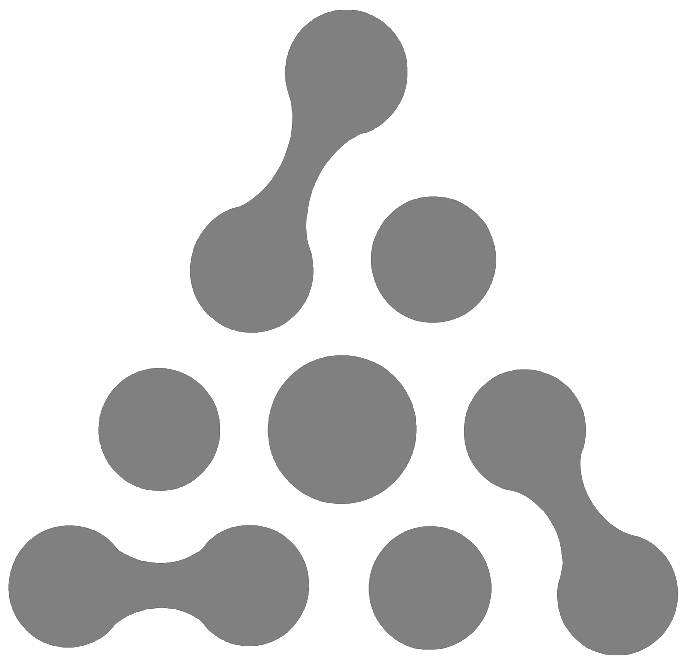

<p align="center">
  
</p>

<h1 align="center">Armada</h1>

<p align="center">
  <strong>Multi-agent orchestration for scaling human developers with AI coding captains.</strong>
  <br />
  <em>Private fork of <a href="https://github.com/jchristn/Armada">jchristn/Armada</a> — v0.9.0 alpha, APIs and schemas may change</em>
</p>

<p align="center">
  <a href="#why-armada">Why Armada</a> |
  <a href="#upstream-vs-fork">Upstream vs Fork</a> |
  <a href="#features">Features</a> |
  <a href="#quick-start">Quick Start</a> |
  <a href="#mcp-integration">MCP</a> |
  <a href="#architecture">Architecture</a> |
  <a href="#license-and-attribution">License</a>
</p>

---

## Why Armada

Armada is an Admiral process that coordinates AI coding agents, called captains, across registered git repositories, called vessels. It gives humans a control plane for dispatching, monitoring, reviewing, and landing agent work without losing context between repositories or terminal sessions.

Use Armada when one prompt in one shell is not enough:

- You want several captains working in parallel without sharing a worktree.
- You need missions to flow through implementation, tests, review, and landing gates.
- You want every mission, voyage, log, diff, check, incident, and release to become durable project memory.
- You need MCP and REST access so humans, dashboards, and orchestrator agents can all operate the same system.

Armada is intentionally vocabulary-heavy because the model mirrors the operating workflow:

| Concept | Meaning |
|---|---|
| Admiral | The server that schedules work, owns persistence, exposes REST/MCP/WebSocket surfaces, and manages landing. |
| Fleet | A collection of related repositories. |
| Vessel | One git repository registered with Armada. |
| Captain | One configured AI worker runtime, such as Claude Code, Codex, Cursor, Gemini, or OpenCode. |
| Mission | One atomic unit of work assigned to a captain. |
| Voyage | A batch of related missions dispatched together. |
| Dock | An isolated git worktree where a captain performs the mission. |

### Who It's For

- Developers who work across multiple repositories and want less context rebuilding.
- Teams that want auditable AI-assisted delivery instead of one-off terminal sessions.
- Operators who need durable checks, releases, deployments, incidents, and runbooks around agent-produced work.
- Orchestrator agents that need a structured MCP surface for creating, monitoring, reviewing, and landing work.

---

## Upstream vs Fork

Armada is a private fork of [jchristn/Armada](https://github.com/jchristn/Armada).
The fork keeps the upstream delivery model and adds automation, retrieval, and
operator controls for larger multi-agent workflows.

| Area | Upstream | This fork |
|---|---|---|
| Core workflow | Missions, voyages, captains, docks, pipelines, and landing | Same model, with more pipeline stages and stronger handoff checks |
| Planning and delivery | Objectives are dispatched by an operator | Autonomous scheduling, build/test gates, recovery, incidents, and durable landing jobs |
| Repository context | Agents work from supplied mission context | Per-vessel code index, symbol graph, semantic search, and dispatch-ready context packs |
| Model routing | Tier-based routing and per-stage captain assignment | Same model, with additional provider-neutral policy and routing controls |
| Runtimes | Multi-runtime support, including OpenCode | Same runtimes, with additional cross-runtime hardening and diagnostics |
| Operator experience | REST, MCP, dashboard, and delivery records | Adds coordination board, session claims, prompt-budget visibility, telemetry, captain chat, and expanded MCP tools |
| Safety and verification | Review and landing workflows | Boundary scanning, isolated checks, sibling-consumer builds, no-op detection, and evidence-driven recovery |

Several features that started in this fork are now also in upstream: the
workspace terminal and diff, Needs You inbox, landing-conflict details,
boundary scanning, auto-land, captain quarantine, model tiers, OpenCode,
no-op completion handling, reasoning effort, project profiles, per-stage
captain assignment, background jobs, token usage, and coordination leases.
They are shared capabilities, not fork-only differences.

The fork-specific additions remain autonomous scheduling, dispatch-armed
build/test gates, evidence-driven recovery, code indexing and context packs,
symbol search, the coordination board and session handoffs, prompt-budget
controls, and the broader operator workflow around these features. The fork
also keeps its own implementations where they are more complete than the
upstream equivalent.

---

## Features

### Multi-Agent Work Management

Armada models work explicitly so a human or orchestrator can inspect every layer:

- Fleets group related vessels and can carry default pipeline settings.
- Vessels store repository URLs, local/bare paths, default branches, landing modes, protected paths, sibling repositories, default playbooks, and code-index settings.
- Captains represent runnable AI workers with runtime, model, persona eligibility, state, health, and current assignment.
- Missions store the actual unit of work, status, persona, preferred model, dependencies, playbook snapshots, logs, diffs, landing state, and output.
- Voyages group missions and preserve shared title, description, vessel, objective, planning-session, playbook, pipeline, and landing context.
- Docks are per-mission git worktrees so captains work on isolated branches instead of sharing the user's checkout.

### Pipelines and Personas

Built-in pipelines let work move through the right level of review:

- `WorkerOnly`: one implementation mission.
- `Reviewed`: Worker followed by Judge.
- `Tested`: Worker, TestEngineer, then Judge.
- `FullPipeline`: Architect, Worker, TestEngineer, then Judge.
- `ProductDevelopment`: Product Manager, Architect, Worker, Usability Engineer, TestEngineer, then Judge.
- Specialist-tested pipelines add a domain reviewer before tests and Judge.
- Reflection pipelines: MemoryConsolidator alone or MemoryConsolidator with parallel Judges.

Personas are stored records, not hardcoded prompt strings. Custom personas and prompt templates can be added through REST or MCP and then referenced by custom pipeline stages.

### Model-Tier Routing

Dispatchers can use `preferredModel` as routing guidance:

- `mid` and `high` select among available captains in a complexity tier; the legacy `low` value maps to `mid`.
- Literal model names remain available for direct pins.
- Pipeline stages can override mission-level routing with their own `PreferredModel`.
- Specialist personas such as Judge, Architect, TestEngineer, and MemoryConsolidator are reserved for high-tier captains by default.
- Reserved high-tier slots keep strong captains available for downstream specialist work instead of being consumed on first-stage Worker missions.

### Code Index, Context Packs, and Graph Search

Armada owns a repository code index for dispatch-time retrieval:

- `armada_code_search` searches indexed chunks for a vessel.
- `armada_context_pack` builds dispatch-ready markdown and returns a prestaged `_briefing/context-pack.md`.
- `armada_fleet_code_search` and `armada_fleet_context_pack` retrieve across a fleet.
- Graph tools search symbols, callers, callees, impact, and affected tests from sidecar files.
- Hybrid search can combine lexical and semantic ranking when semantic search is enabled.
- Context packs can be attached automatically during MCP dispatch and architect decomposition.
- Merge landing can refresh the index in the background so later missions see newly landed code.

### Merge Queue and Automated Landing

Armada can leave work for manual inspection or land it through configured modes:

| Mode | Behavior |
|---|---|
| `MergeQueue` | Enqueue work, create a temporary integration worktree, run validation, push, reconcile, and clean up branches sequentially per vessel and target branch. |
| `LocalMerge` | Merge the mission branch directly into the configured local working directory, without pushing to origin. |
| `PullRequest` | Push the branch and open a PR/MR; the mission remains `PullRequestOpen` until the PR is merged. |
| `None` | Stop at `WorkProduced`; the branch remains available for manual integration. |

Landing features include auto-land predicates, protected-path checks, convention and critical-trigger gates, PR fallback, target-branch-drift retry, durable landing jobs, restart recovery, branch cleanup policies, pull-request reconciliation, and merge-queue purge/cancel tools.

### Structured Delivery Operations

Armada is not only a captain launcher. It also keeps delivery records connected to the work:

- Objectives and backlog items track scope, priority, effort, acceptance criteria, non-goals, rollout constraints, owners, tags, and evidence links.
- Planning and backlog-refinement sessions preserve captain-backed scoping conversations before dispatch.
- Workflow profiles define build, test, package, deploy, rollback, smoke-test, and health-check commands.
- Check runs persist structured validation output and can import external CI results.
- Releases collect linked voyages, missions, checks, notes, versions, tags, and artifacts.
- Release shipping can notify an external CD system through an authenticated webhook (`cdWebhook`), with bounded retries, per-release delivery history, and a synthetic-payload test tool.
- Deployments support approval, execution, verification, and rollback records.
- Incidents track operational issues, hotfix handoff, evidence, mitigation, and closure.
- Runbooks provide guided operational procedures with execution history.
- The historical timeline correlates objectives, planning, dispatch, checks, releases, deployments, incidents, events, merge activity, request history, and runbook execution.

### Captain Health and Quarantine

The Admiral tracks captain state and health so a busy fleet remains debuggable:

- Captains move through idle, assigned, in-progress, planning, stopped, quarantined, and failure states.
- Health checks reclaim stale captains and docks after restarts.
- Diagnostics report active mission timing, dock git status, uncommitted files, launch/log hints, and code-index freshness.
- Quarantine and lifecycle controls prevent unhealthy captains — including those hitting provider quota or usage limits — from repeatedly taking work until an operator or reset window intervenes.
- Stop, recall, stop-all, and emergency controls are exposed through MCP, REST, dashboard, and WebSocket flows.

### Playbooks and Persistent Memory

Playbooks are reusable markdown guidance that can be delivered inline, referenced, or attached into the worktree. Fleet, vessel, persona, captain, voyage, and per-mission selections merge into mission playbook snapshots so every captain receives the guidance that applied at dispatch time.

Reflection memory turns accepted mission evidence into reviewable learned notes for future missions. Vessel learned facts, persona notes, captain behavior anchors, pack hints, and fleet hints can be consolidated and reviewed instead of rediscovered by each new captain.

### Interfaces

Armada exposes the same operating model through multiple surfaces:

- REST API for dashboards, scripts, and external services.
- MCP HTTP endpoint for orchestrator agents.
- MCP stdio command for clients that prefer local framed or stdio transport.
- WebSocket events for live dashboard updates.
- Helm CLI for setup, config, server start, and MCP installation.
- React/Vite dashboard for operators.

### Persistence

Armada persists state through database drivers for SQLite, PostgreSQL, MySQL, and SQL Server. Missions, voyages, captains, docks, events, playbooks, pipelines, objectives, checks, releases, deployments, incidents, runbooks, request history, and merge-queue records are stored outside agent sessions so the system can recover, audit, and resume.

**Deployment note:** The active Armada server uses PostgreSQL. A file named
`armada.db` is a SQLite example or test artifact; it is not the database used
by the active server. Confirm the configured database type before inspecting or
deleting any database-looking file.

---

## Quick Start

### Prerequisites

- .NET 10.0 SDK.
- Git.
- At least one supported agent CLI if you want local captains: Claude Code, Codex, Cursor, Gemini, or OpenCode.
- Optional for pull requests: `gh` for GitHub or `glab` for GitLab.

### Build

```bash
dotnet build src/Armada.sln
```

### Start the Admiral

```bash
dotnet run --project src/Armada.Server --framework net10.0
```

Default local endpoints:

- REST and dashboard: `http://localhost:7890`
- MCP Streamable HTTP: `http://localhost:7891/mcp`

### Configure MCP Clients

The repository includes an MCP config that points at the default HTTP endpoint:

```json
{
  "mcpServers": {
    "armada": {
      "type": "http",
      "url": "http://localhost:7891/mcp"
    }
  }
}
```

Helm can install managed MCP entries for supported clients:

```bash
dotnet run --project src/Armada.Helm --framework net10.0 -- mcp install
```

### Dispatch a Voyage Through MCP

`armada_dispatch` requires a top-level `vesselId`. Put `preferredModel` on each mission that needs routing guidance.

```json
{
  "title": "Improve status health output",
  "description": "Make the health endpoint easier for operators to inspect.",
  "vesselId": "vsl_example123",
  "pipeline": "Reviewed",
  "codeContextMode": "auto",
  "missions": [
    {
      "alias": "worker",
      "title": "Add concise health details",
      "description": "Update the status health response and dashboard copy. Keep the change focused and run the relevant build or smoke check.",
      "preferredModel": "mid"
    },
    {
      "title": "Review health details",
      "description": "Review the worker diff for correctness, regressions, and missing validation.",
      "dependsOnMissionAlias": "worker",
      "alias": "review",
      "preferredModel": "high"
    }
  ]
}
```

For dependency aliases, assign `alias` to the upstream mission and reference it from `dependsOnMissionAlias` on the downstream mission:

```json
{
  "title": "Two-stage implementation",
  "vesselId": "vsl_example123",
  "missions": [
    {
      "alias": "worker",
      "title": "Implement the change",
      "description": "Make the code change and commit it.",
      "preferredModel": "mid"
    },
    {
      "alias": "judge",
      "title": "Judge the change",
      "description": "Review the implementation and emit a verdict.",
      "dependsOnMissionAlias": "worker",
      "preferredModel": "high"
    }
  ]
}
```

### Run on system startup

To keep the Admiral running across reboots, use the scripted startup workflow. It publishes
`Armada.Server` into `~/.armada/bin`, deploys the dashboard, registers a platform service
definition, and verifies health on boot. Full guide:
[docs/RUN_ON_STARTUP.md](docs/RUN_ON_STARTUP.md).

Install the local deployment:

| Platform | Install | Update | Health check |
|---|---|---|---|
| Linux (`systemd --user`) | `scripts/linux/install-systemd-user.sh` | `scripts/linux/update-systemd-user.sh` | `scripts/linux/healthcheck-server.sh` |
| macOS (`launchd`) | `scripts/macos/install-launchd-agent.sh` | `scripts/macos/update-launchd-agent.sh` | `scripts/macos/healthcheck-server.sh` |
| Windows (scheduled task) | `scripts/windows/install-windows-task.bat` | `scripts/windows/update-windows-task.bat` | `scripts/windows/healthcheck-server.bat` |

Run the install script once, then use the update script after each rebuild to republish the
server and restart the service. The health-check helper verifies the dashboard responds.

---

## MCP Integration

The primary MCP transport is HTTP JSON-RPC at:

```text
http://localhost:7891/mcp
```

Armada uses the official MCP C# SDK and supports the stateless MCP
`2026-07-28` protocol as well as legacy initialization-based clients. The
former `/rpc` path remains available as a compatibility alias.

Common MCP tool groups:

- Fleet, vessel, captain, mission, voyage, dock, signal, event, persona, prompt-template, and pipeline enumeration.
- Dispatch, architect decomposition, mission status, voyage status, logs, diffs, and status transitions.
- Merge queue enqueue, process, retry, cancel, purge, and PR reconciliation.
- Code index status, update, search, context pack, fleet context pack, graph symbols, callers, callees, impact, and affected tests.
- Objective/backlog CRUD, refinement, planning, dispatch linkage, and the autonomous objective scheduler.
- Check run, release, deployment, incident, and runbook operations.
- Playbook management, mission playbook snapshots, and reflection memory.
- Captain diagnostics, quarantine controls, AgentWake registration, long-running-job status, and wake notifications.

Discover live tool descriptions and input schemas with `tools/list`. Follow
`nextCursor` until it is absent. The complete operator workflow and current
catalog are in [`docs/armada-ops.md`](docs/armada-ops.md); transport behavior
is in [`docs/MCP_API.md`](docs/MCP_API.md).

---

## REST and Dashboard

The Admiral server exposes REST routes under `/api/v1/*`, serves the dashboard from the same HTTP server, and broadcasts live state through WebSocket. REST and MCP share the same database-backed services, so operators can mix dashboard workflows, scripts, and orchestrator-agent calls without splitting state.

Useful REST areas include:

- `/api/v1/status`
- `/api/v1/fleets`
- `/api/v1/vessels`
- `/api/v1/captains`
- `/api/v1/missions`
- `/api/v1/voyages`
- `/api/v1/merge-queue`
- `/api/v1/objectives`
- `/api/v1/check-runs`
- `/api/v1/releases`
- `/api/v1/deployments`
- `/api/v1/incidents`
- `/api/v1/runbooks`
- `/api/v1/events/token-usage` (authoritative per-runtime/model token telemetry)

---

## Architecture

```text
src/
  Armada.Core       Domain models, settings, database drivers, services, code index, and interfaces
  Armada.Runtimes   Runtime adapters for Claude Code, Codex, Cursor, Gemini, OpenCode, and extensible agents
  Armada.Server     Admiral REST/MCP/WebSocket server, orchestrators, and dashboard host
  Armada.Helm       CLI for config, server start, and MCP setup
  Armada.Dashboard  React/Vite operator dashboard
```

The server constructs most services directly in `ArmadaServer.cs` and runs the fork's background orchestrators (objective scheduler, automatic check runs, autonomous recovery, incident lifecycle, code-index refresh) off the health loop. Database drivers cover SQLite, PostgreSQL, MySQL, and SQL Server. Runtime adapters implement the shared captain process contract while preserving each CLI's launch and environment requirements.

---

## Build and Test

Build the solution:

```bash
dotnet build src/Armada.sln
```

Run test projects on .NET 10:

```bash
dotnet run --project test/Armada.Test.Automated --framework net10.0
dotnet run --project test/Armada.Test.Unit --framework net10.0
dotnet run --project test/Armada.Test.Runtimes --framework net10.0
```

Dashboard asset changes require:

```bash
npm.cmd run build
```

from `src/Armada.Dashboard`.

---

## License and Attribution

Armada was created by [jchristn](https://github.com/jchristn) as [`jchristn/Armada`](https://github.com/jchristn/Armada). This repository is a private fork that builds on that work; all upstream copyright and attribution are retained.

Armada is licensed under the terms in [LICENSE.md](LICENSE.md).
